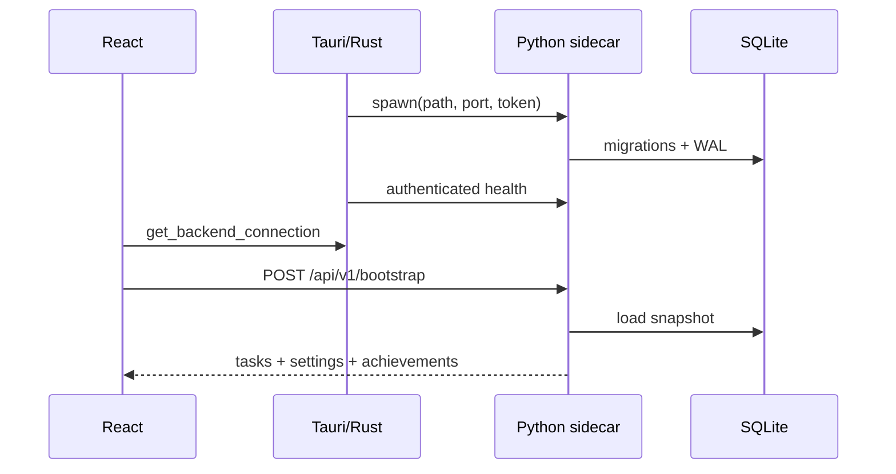

# 桌面运行架构

## 启动顺序

1. Tauri single-instance 插件先注册；第二次启动只聚焦已有窗口。
2. Rust 在应用数据目录创建 `todo.sqlite3` 路径，选择回环端口并生成随机 256-bit token。
3. Tauri 以 external binary 启动 Python sidecar，通过环境传入数据库路径、端口和 token。
4. Rust 在单个 10 秒预算内轮询 authenticated health，端口启动失败最多尝试三次。
5. React 调用 `get_backend_connection`，创建 typed API client，再 POST `/bootstrap`。
6. 只有 bootstrap 成功后才挂载主应用；普通浏览器显示 unsupported 状态。

## 正常运行

- Rust 持有 child handle；JavaScript 没有 shell spawn/execute 权限。
- 前端 mutation 通过 Bearer API 提交，成功后才更新 UI。
- 窗口关闭只隐藏到托盘，sidecar 保持运行。
- 真正退出应用时 Rust 终止 child；Python/Uvicorn 停止服务，SQLite 连接按事务关闭。
- 开机自启动状态由 Tauri 插件/操作系统持有，不写入 SQLite。

## 失败与重试

sidecar 意外退出、bootstrap 失败或 mutation 遇到基础设施错误时，React 用阻断页替换主界面。普通请求不会在后台静默重启已失败的 sidecar。

用户点击重试后：

1. Rust 串行化一个 retry wave，停止可能残留的旧 child。
2. 生成新的端口/token 并启动 sidecar。
3. React 重新 bootstrap，并用完整快照替换旧内存状态。

失败会被缓存，只有显式 retry 能清除。这样不会同时启动多个后端，也不会继续使用可能过期的 UI state。

## 安全边界

- 后端强制绑定 `127.0.0.1`，每次启动使用随机 token。
- token 只在进程内存和 Tauri command 返回值中存在，不写磁盘或日志。
- CSP 只允许 app assets、Tauri IPC 和 `127.0.0.1:*` 连接。
- CORS 允许生产 Tauri origin；Vite origin 仅在 debug sidecar 环境启用。
- 后端关闭 access log，公开错误不含请求正文、任务内容、路径、SQL 参数或 traceback。
- shortcut 注册与 SQLite 持久化由 Rust 协调；回滚或清理失败升级为阻断错误。

## 打包与签名

`desktop/scripts/build-sidecar.sh` 使用 uv + PyInstaller 构建 arm64 sidecar，并放入 Tauri `externalBin` 目录。`npm --prefix desktop run build` 先构建前端和 sidecar，再生成 `.app`/DMG。

ad-hoc 签名顺序是：内嵌 `todo-backend` → 包含它的 `.app` → DMG。详见 [安装与构建](installation.md)。
